# AI Agent Memory Database Design

How to build a database that stores AI agent context, memory, and shares them with ACL across agents.

## The Core Insight

AI agent memory is not just "store vectors." It's a **multi-modal, multi-tenant, temporally-aware knowledge graph with access control**. No existing database handles this because they were designed for *queries about data*, not *agents reasoning about their own experience*.

What an AI agent actually needs:

```
Agent receives: "The user prefers dark mode and hates popup notifications"
                    ↓
Agent must:
  1. EXTRACT facts:    {prefers: "dark_mode", hates: "popups"}
  2. CLASSIFY type:    → user_preference (long-term, high importance)
  3. STORE with meta:  source, confidence, timestamp, owner, ACL
  4. RETRIEVE later:   "What does this user prefer?" → dark_mode
  5. SHARE selectively: Agent B can read preferences but not internal reasoning
  6. DECAY over time:  Confidence fades if not reinforced
  7. CONFLICT resolve: New observation overrides stale memory
```

This is fundamentally different from RAG (retrieve documents → augment generation). This is **agent cognition infrastructure**.

---

## Memory Types

An AI agent has different memory types, each with different storage and retrieval needs:

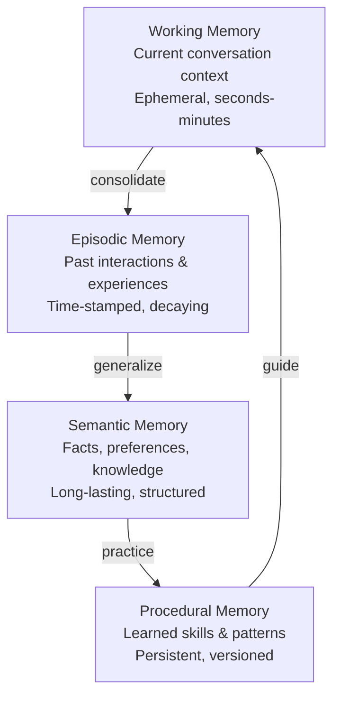

| Type | Lifetime | Structure | Retrieval | Example |
|------|----------|-----------|-----------|---------|
| **Working** | Seconds-minutes | Conversation buffer | Temporal (most recent) | "User just said they're tired" |
| **Episodic** | Hours-months | Event + context + outcome | Similarity + temporal | "Last time user asked about X, they liked Y" |
| **Semantic** | Permanent | Entity + attribute + value | Structured + semantic | "User prefers dark mode" |
| **Procedural** | Permanent | Task → steps + conditions | Task matching | "When user asks about deployment, check staging first" |

---

## Data Model

```sql
-- The core memory unit
CREATE TABLE memories (
    id              UUID PRIMARY KEY,
    
    -- Who and what
    owner_id        VARCHAR NOT NULL,       -- agent_id who created this memory
    memory_type     VARCHAR NOT NULL,       -- 'working', 'episodic', 'semantic', 'procedural'
    
    -- Content
    content         TEXT NOT NULL,          -- natural language content
    embedding       VECTOR(1536),          -- semantic embedding of content
    entities        JSONB,                 -- extracted entities: [{name, type, value}]
    relations       JSONB,                 -- extracted relations: [{subject, predicate, object, confidence}]
    
    -- Time
    created_at      TIMESTAMP NOT NULL,
    accessed_at     TIMESTAMP,             -- last retrieval time
    expires_at      TIMESTAMP,             -- TTL for working/episodic memory
    
    -- Confidence & Importance
    confidence      FLOAT DEFAULT 1.0,     -- 0.0 to 1.0, decays over time
    importance      FLOAT DEFAULT 0.5,     -- 0.0 to 1.0, agent-assigned
    
    -- Provenance
    source_type     VARCHAR,               -- 'observation', 'inference', 'shared', 'user_stated'
    source_agent_id  VARCHAR,              -- who provided this (for shared memories)
    source_turn_id  VARCHAR,               -- conversation turn that created this
    
    -- Versioning
    version         INT DEFAULT 1,
    superseded_by   UUID REFERENCES memories(id),  -- linked list of updates
    
    -- Indexes
    FULLTEXT INDEX(content),
    VECTOR INDEX(embedding)
);

-- Access control: who can see what
CREATE TABLE memory_acls (
    memory_id       UUID REFERENCES memories(id),
    grantor_id       VARCHAR NOT NULL,      -- agent who granted access
    grantee_id       VARCHAR NOT NULL,      -- agent who receives access
    permission       VARCHAR NOT NULL,      -- 'read', 'read_write', 'admin'
    scope            VARCHAR NOT NULL,      -- 'content', 'embedding', 'entities', 'relations', 'all'
    conditions       JSONB,                 -- e.g., {"min_confidence": 0.7, "memory_type": "semantic"}
    granted_at       TIMESTAMP NOT NULL,
    expires_at       TIMESTAMP,
    revoked_at       TIMESTAMP
);

-- Memory links: how memories relate to each other
CREATE TABLE memory_links (
    source_id        UUID REFERENCES memories(id),
    target_id        UUID REFERENCES memories(id),
    link_type         VARCHAR NOT NULL,      -- 'supports', 'contradicts', 'derived_from', 'supersedes', 'context_of'
    confidence       FLOAT DEFAULT 1.0,
    created_at       TIMESTAMP NOT NULL
);

-- Memory access log: for learning what's useful
CREATE TABLE memory_access_log (
    memory_id        UUID REFERENCES memories(id),
    agent_id         VARCHAR NOT NULL,
    access_type      VARCHAR NOT NULL,       -- 'read', 'write', 'share', 'forget'
    query_context    TEXT,                   -- what prompted this access
    relevance_score  FLOAT,                 -- how useful was this memory (feedback)
    accessed_at      TIMESTAMP NOT NULL
);
```

---

## ACL Model: How Agents Share Memory

This is the hardest design problem. Current vector databases have no concept of "who can see what." Here's a capability-based ACL model:

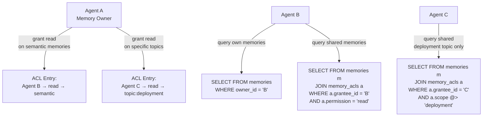

### ACL Scope Levels

| Scope | Description | Example Use |
|-------|-------------|-------------|
| `all` | Full access to memory content + metadata | Same-team agents |
| `content` | Can read text but not embedding/entities | Cross-team read-only |
| `embedding` | Can do similarity search but not read content | Routing/orchestration agents |
| `entities` | Can read extracted entities but not raw content | Metadata indexing |
| `relations` | Can read knowledge graph but not source | Graph traversal agents |
| `topic:X` | Can read memories matching topic X | Domain-scoped sharing |
| `memory_type:Y` | Can read only specific memory type | Share semantics, not episodes |

### ACL Conditions (JSONB filters)

```json
{
    "min_confidence": 0.7,
    "memory_type": ["semantic", "procedural"],
    "topics": ["deployment", "infrastructure"],
    "max_age_hours": 24,
    "source_type": ["observation", "user_stated"]
}
```

This lets an agent say: "Agent B can read my semantic memories about deployment, but only if confidence > 0.7 and created in the last 24 hours."

---

## Memory Lifecycle

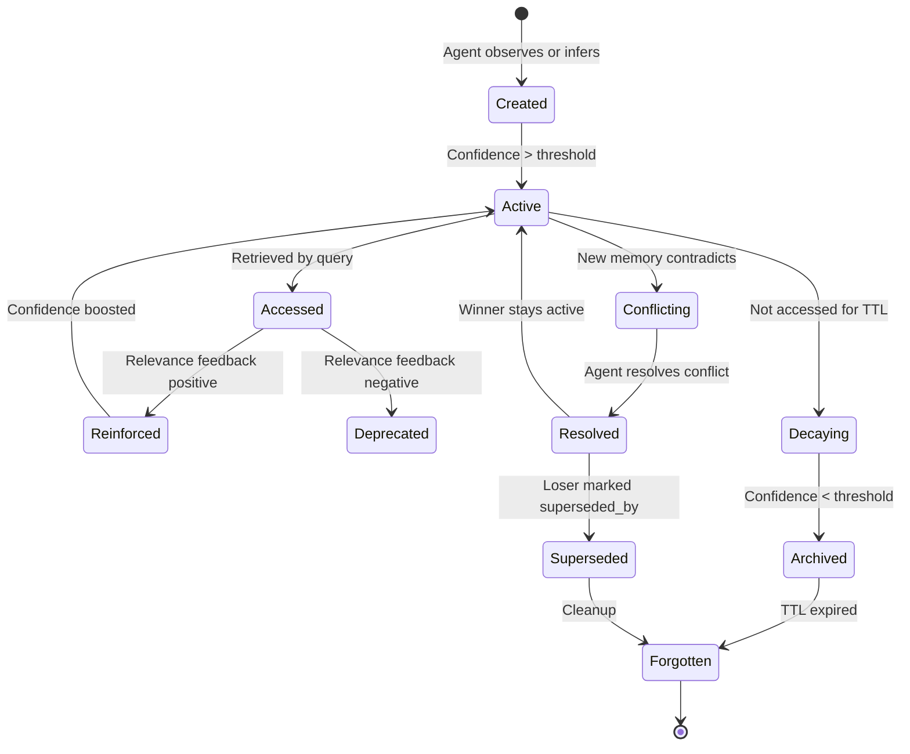

### Confidence Decay Function

```python
# Exponential decay with reinforcement
def current_confidence(memory, now):
    base = memory.confidence
    age_hours = (now - memory.accessed_at).total_seconds() / 3600
    decay_rate = 0.01  # per hour
    
    # Number of positive reinforcements
    reinforcement = memory.access_log.filter(relevance_score > 0.7).count()
    boost = 1.0 + 0.1 * min(reinforcement, 10)
    
    return base * boost * math.exp(-decay_rate * age_hours)
```

Memories that are frequently accessed and useful get reinforced. Unused memories decay and eventually get garbage collected.

---

## Query Patterns

### Pattern 1: Recall (Retrieve relevant memories)

```sql
-- "What do I know about this user's preferences?"
SELECT id, content, confidence, memory_type, created_at
  FROM memories m
 WHERE m.owner_id = CURRENT_AGENT
   AND m.memory_type IN ('semantic', 'episodic')
   AND m.superseded_by IS NULL
   AND m.confidence > 0.5
   AND VECTOR_DISTANCE(m.embedding, EMBED('user preferences', :model)) < 0.3
 ORDER BY m.importance DESC, m.confidence DESC
 LIMIT 10;
```

### Pattern 2: Recall with ACL (Agent B reads Agent A's memory)

```sql
-- "What does Agent A know about deployment?"
SELECT m.id, m.content, m.confidence
  FROM memories m
  JOIN memory_acls a ON m.id = a.memory_id
 WHERE a.grantee_id = CURRENT_AGENT
   AND a.permission IN ('read', 'read_write')
   AND a.revoked_at IS NULL
   AND (a.expires_at IS NULL OR a.expires_at > NOW())
   AND a.grantor_id = 'agent_a'
   AND m.memory_type = 'semantic'
   AND m.confidence > COALESCE(a.conditions->>'min_confidence', '0.0')::FLOAT
   AND VECTOR_DISTANCE(m.embedding, EMBED('deployment practices', :model)) < 0.3
 ORDER BY m.confidence DESC
 LIMIT 5;
```

### Pattern 3: Store (Consolidate from working → episodic/semantic)

```sql
-- At end of conversation, consolidate working memories
INSERT INTO memories (id, owner_id, memory_type, content, embedding, 
                      confidence, importance, source_type, source_turn_id)
SELECT gen_uuid(), m.owner_id, 
       CASE WHEN extractable_fact(m.content) THEN 'semantic' ELSE 'episodic' END,
       summarize(m.content),                     -- LLM call: summarize
       EMBED(summarize(m.content), :model),     -- generate embedding
       m.confidence * 0.8,                        -- slight confidence reduction
       classify_importance(m.content),           -- LLM call: importance scoring
       m.source_type, m.source_turn_id
  FROM memories m
 WHERE m.owner_id = CURRENT_AGENT
   AND m.memory_type = 'working'
   AND m.created_at > NOW() - INTERVAL '1 hour'
   AND m.importance > 0.3;
```

### Pattern 4: Conflict Resolution

```sql
-- Find contradictions between memories
SELECT m1.id AS old_memory, m1.content AS old_content,
       m2.id AS new_memory, m2.content AS new_content
  FROM memories m1
  JOIN memory_links l ON l.source_id = m1.id AND l.link_type = 'contradicts'
  JOIN memories m2 ON l.target_id = m2.id
 WHERE m1.owner_id = CURRENT_AGENT
   AND m1.superseded_by IS NULL
   AND m2.superseded_by IS NULL
   AND m1.confidence < m2.confidence;
   
-- Resolve: supersede the lower-confidence memory
UPDATE memories SET superseded_by = :winner_id WHERE id = :loser_id;
```

### Pattern 5: Share Memory

```sql
-- Agent A shares deployment knowledge with Agent B
INSERT INTO memory_acls (memory_id, grantor_id, grantee_id, permission, scope, conditions, granted_at)
SELECT m.id, 'agent_a', 'agent_b', 'read', 'content',
       '{"min_confidence": 0.7, "memory_type": ["semantic", "procedural"]}'::JSONB,
       NOW()
  FROM memories m
 WHERE m.owner_id = 'agent_a'
   AND m.memory_type IN ('semantic', 'procedural')
   AND m.content LIKE '%deployment%'
   AND m.superseded_by IS NULL;
```

### Pattern 6: Forget (Garbage Collect)

```sql
-- Periodic maintenance: archive and forget decayed memories
UPDATE memories SET memory_type = 'archived'
 WHERE owner_id = CURRENT_AGENT
   AND memory_type = 'episodic'
   AND confidence < 0.1
   AND accessed_at < NOW() - INTERVAL '30 days';

DELETE FROM memories
 WHERE memory_type = 'archived'
   AND accessed_at < NOW() - INTERVAL '90 days';
```

---

## Architecture

```mermaid
graph TD
    subgraph Query Layer
        SQL[SQL Parser + Extended Syntax<br/>EMBED(), VECTOR_DISTANCE(), RECALL, SHARE, FORGET]
        OPT[Hybrid Optimizer<br/>structured → columnar scan<br/>semantic → ANN index<br/>full-text → inverted index]
        ACL_ENFORCER[ACL Enforcer<br/>injects JOIN memory_acls<br/>into every query]
    end

    subgraph Memory Services
        CONSOLIDATE[Consolidation Service<br/>working → episodic → semantic<br/>background, LLM-powered]
        CONFLICT[Conflict Resolver<br/>detects contradictions<br/>resolves by confidence]
        DECAY[Decay Service<br/>confidence decay over time<br/>garbage collection]
        EMBED_SVC[Embedding Service<br/>model versioning<br/>batch + real-time]
    end

    subgraph Storage
        COL_STORE[Columnar Store<br/>structured fields, JSONB<br/>zone maps, bloom filters]
        VEC_INDEX[Vector Index<br/>HNSW (RAM) / DiskANN (disk)<br/>per-owner sharding]
        FT_INDEX[Full-Text Index<br/>inverted + BM25<br/>per-owner partitioning]
        KG[Knowledge Graph<br/>entities + relations<br/>memory_links as edges]
    end

    subgraph Cross-Agent
        ACL_STORE[ACL Store<br/>memory_acls table<br/>capability-based, conditional]
        AUDIT[Access Audit Log<br/>memory_access_log<br/>relevance feedback]
        BROKER[Memory Broker<br/>negotiates sharing<br/>revocation propagation]
    end

    SQL --> OPT --> ACL_ENFORCER
    ACL_ENFORCER --> COL_STORE
    ACL_ENFORCER --> VEC_INDEX
    ACL_ENFORCER --> FT_INDEX
    ACL_ENFORCER --> KG

    CONSOLIDATE --> COL_STORE
    CONFLICT --> KG
    DECAY --> COL_STORE
    EMBED_SVC --> VEC_INDEX

    ACL_STORE --> ACL_ENFORCER
    AUDIT --> CONSOLIDATE
    BROKER --> ACL_STORE
```

---

## Key Design Decisions

### 1. Per-Agent Storage Isolation

**Option A: Shared tables with owner_id filter** (Recommended)
- All agents' memories in same tables
- `owner_id` column + row-level security for isolation
- ACL is just a JOIN — simple, auditable
- Trade-off: noisy neighbor risk, but storage is shared efficiently

**Option B: Per-agent schema/namespace**
- Each agent gets its own table partition
- Stronger isolation but harder to share
- Trade-off: operational complexity, cross-agent queries are complex

**Option C: Per-agent database**
- Maximum isolation
- Trade-off: resource waste, cross-agent sharing requires federation

### 2. Consistency vs Performance for ACL Checks

| Strategy | Latency | Consistency | Use When |
|----------|---------|-------------|----------|
| **ACL cache per query** | Fast (cache hit) | eventual | Most reads |
| **ACL lookup per memory** | Slow | strong | Revocation-sensitive ops |
| **Pre-filtered ACL views** | Fastest | eventual | High-throughput reads |

Recommended: Cache ACL entries per `(grantee_id, grantor_id)` pair with TTL. Re-validate on revocation.

### 3. Embedding: Who Generates It?

| Strategy | Latency | Freshness | Cost |
|----------|---------|-----------|------|
| **Client embeds** | Low (no round-trip) | Stale if model changes | Client pays |
| **DB embeds at ingest** | Medium | Always current | DB pays |
| **DB embeds on read** | High | Always current | DB pays per read |

Recommended: **DB embeds at ingest** with model version tag. On model upgrade, background re-embed job with lazy migration.

### 4. Knowledge Graph vs Relational Links

| Approach | Pros | Cons |
|----------|------|------|
| **memory_links table** | Simple, SQL-queryable, auditable | No native graph traversal |
| **Embedded graph DB** | Fast traversal, path queries | Complexity, dual-storage |
| **JSONB relations column** | Flexible schema, no joins needed | No index, slow queries |

Recommended: Start with `memory_links` table + `relations` JSONB column. Add graph traversal (BFS/DFS) as a SQL extension later.

---

## New SQL Primitives for Agent Memory

```sql
-- RECALL: semantic retrieval with automatic ranking
RECALL FROM memories 
  WHERE owner_id = CURRENT_AGENT
  AND query = 'user deployment preferences'
  AND memory_type = 'semantic'
  LIMIT 5;
-- Internally: embeds the query, does ANN search, applies confidence filter

-- REMEMBER: store a memory with auto-extraction
REMEMBER 'User prefers blue color theme'
  WITH owner_id = CURRENT_AGENT,
       memory_type = 'semantic',
       importance = 0.8,
       source_type = 'user_stated';
-- Internally: embed content, extract entities/relations, store

-- SHARE: grant ACL to another agent
SHARE MEMORY WHERE owner_id = CURRENT_AGENT
  AND memory_type = 'semantic'
  AND content LIKE '%deployment%'
  WITH AGENT 'agent_b'
  PERMISSION read
  SCOPE content
  CONDITIONS '{"min_confidence": 0.7}';

-- FORGET: explicit deletion or decay-to-forget
FORGET MEMORY :memory_id;
-- Or schedule:
FORGET MEMORY :memory_id AFTER INTERVAL '7 days';

-- CONSOLIDATE: trigger working → semantic promotion
CONSOLIDATE MEMORIES 
  WHERE owner_id = CURRENT_AGENT
  AND memory_type = 'working'
  AND created_at > NOW() - INTERVAL '1 hour';

-- REFLECT: detect contradictions in own memory
REFLECT ON MEMORIES 
  WHERE owner_id = CURRENT_AGENT
  AND memory_type = 'semantic';
-- Returns: contradictions, low-confidence items, stale memories
```

---

## What Makes This Different From Existing Systems

| Capability | Pinecone/Qdrant | Weaviate | StarRocks | PostgreSQL+pgvector | **Agent Memory DB** |
|-----------|----------------|----------|-----------|---------------------|---------------------|
| Vector search | ✓ | ✓ | partial | partial | ✓ |
| Structured filter | ✗ | partial | ✓ | ✓ | ✓ |
| Full-text | ✗ | partial | ✓ | ✓ | ✓ |
| Confidence decay | ✗ | ✗ | ✗ | ✗ | ✓ |
| Memory versioning | ✗ | ✗ | ✗ | ✗ | ✓ |
| Agent ACL | ✗ | ✗ | ✗ | row-level security | ✓ (capability-based) |
| Conditional sharing | ✗ | ✗ | ✗ | ✗ | ✓ (JSONB conditions) |
| Conflict detection | ✗ | ✗ | ✗ | ✗ | ✓ (memory_links) |
| Consolidation | ✗ | ✗ | ✗ | ✗ | ✓ (working→semantic) |
| Access audit | ✗ | ✗ | ✗ | ✗ | ✓ (relevance feedback loop) |
| Multi-modal embeddings | ✗ | ✗ | ✗ | ✗ | ✓ |
| Chunk-entity hierarchy | ✗ | ✗ | ✗ | ✗ | ✓ |

---

## Build Order

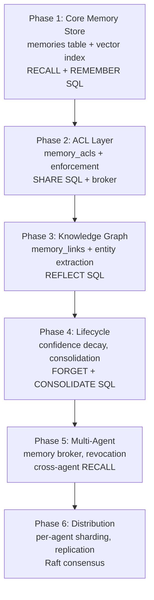

### Phase 1: Core Memory Store (~2-3 months)
- `memories` table with content, embedding, metadata columns
- HNSW index for vector similarity
- `RECALL` and `REMEMBER` SQL primitives
- Confidence field (static, no decay yet)
- Single agent only

### Phase 2: ACL Layer (~1-2 months)
- `memory_acls` table with grantor/grantee/permission/scope/conditions
- ACL enforcer injected into every query plan
- `SHARE` SQL primitive
- ACL cache for fast reads

### Phase 3: Knowledge Graph (~1-2 months)
- `memory_links` table for memory relationships
- Entity/relation extraction at ingest (LLM call)
- Conflict detection via contradicting links
- `REFLECT` SQL primitive

### Phase 4: Lifecycle (~1-2 months)
- Confidence decay background service
- `CONSOLIDATE` working → semantic promotion
- `FORGET` with TTL and garbage collection
- Access audit → relevance feedback → reinforcement

### Phase 5: Multi-Agent (~2-3 months)
- Memory broker for cross-agent sharing negotiation
- Revocation propagation
- Cross-agent `RECALL` with ACL enforcement
- Access audit across agent boundaries

### Phase 6: Distribution (~2-3 months)
- Per-agent sharding (each agent's memories on specific nodes)
- Replication for fault tolerance
- Raft consensus for metadata
- Cross-shard recall with top-K merge## Pain-Point Impact on Design

The 8 AI database pain points documented in `ai-database-pain-points.md` force major revisions to the original design. Each pain point invalidates at least one assumption in the initial data model and architecture.

### Impact Summary

| # | Pain Point | Original Assumption | Revised Design |
|---|-----------|---------------------|----------------|
| 1 | Hybrid Query | ACL as a JOIN (post-filter) | ACL as a **pre-filter partition** (routing decision) |
| 2 | Embedding Pipeline | Single `embedding VECTOR(1536)` column | **`memory_embeddings` one-to-many table** with model versioning |
| 3 | Storage Mismatch | One storage engine fits all | **Columnar + segmented HNSW** — two cooperating subsystems |
| 4 | RAM vs Disk | All vectors in RAM (HNSW) | **Memory-type-driven storage tiering** (RAM → NVMe → object) |
| 5 | Real-Time Index Updates | Single global HNSW | **Per-owner, per-model segmented HNSW** (append-merge, LSM-tree analogy) |
| 6 | Inference Cost at Ingest | Synchronous `REMEMBER` (embed on write) | **Async ingest pipeline**: full-text immediately, embed/index in background |
| 7 | Multi-Modal Embeddings | One embedding per memory | **Multiple embeddings per memory** in `memory_embeddings` table |
| 8 | Chunk-Entity Hierarchy | Memory = flat unit | **Hierarchical composition** via `memory_chunks` table |

---

### 1. ACL as Pre-Filter Partition (from Pain Point #1)

**Problem:** In the original design, ACL was enforced via `JOIN memory_acls` — a post-filter on query results. In a hybrid query (structured + vector + full-text), a post-filter on vector search leaks information: the agent can observe result rankings before and after ACL filtering, inferring the existence of memories it cannot read (side-channel).

**Revised design:** ACL becomes a **routing decision at the partition pruner level**, not a post-filter.

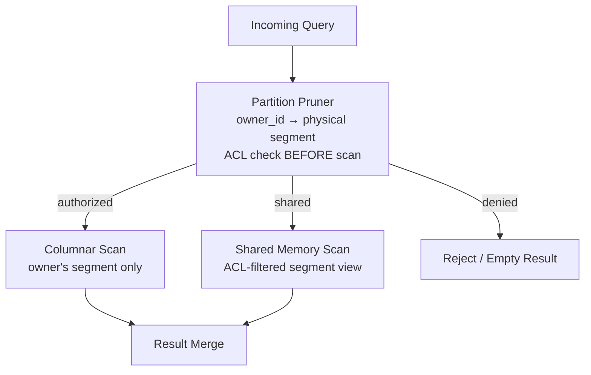

**Data model change:** Add `owner_partition SMALLINT` to `memories` table. This is a hash of `owner_id` that maps to a physical segment. The ACL enforcer resolves ACL entries **before** any scan begins, routing the query only to segments the agent is authorized to read. This eliminates side-channel leakage because unauthorized segments are never touched.

**Trade-off:** This means ACL checks happen at the segment/partition level, not the individual row level. Fine-grained row-level ACL (e.g., "Agent B can read only semantic memories about deployment") requires filtering within a shared segment. The compromise:

- **Coarse ACL** (agent-level): Partition pruner — zero leakage, fastest
- **Fine ACL** (topic/type-level): Within-partition filter — minimal leakage (agent knows segment exists but not specific rows)

---

### 2. Multi-Model Embedding Table (from Pain Points #2, #7)

**Problem:** The original `memories` table had a single `embedding VECTOR(1536)` column. This assumes one model, one dimension, one embedding type. In reality:

- A memory's text needs a dense embedding (e.g., text-embedding-3-large, 3072d)
- The same text may need a sparse BM25 vector (variable dimension)
- Images attached to a memory need CLIP embeddings (768d)
- Model upgrades mean every embedding becomes stale — you cannot mutate in-place because concurrent queries depend on consistency

**Revised design:** Replace the single `embedding` column with a **one-to-many** `memory_embeddings` table:

```sql
CREATE TABLE memory_embeddings (
    id              UUID PRIMARY KEY,
    memory_id       UUID NOT NULL REFERENCES memories(id) ON DELETE CASCADE,
    model_name      VARCHAR NOT NULL,        -- 'text-embedding-3-large'
    model_version   VARCHAR NOT NULL,       -- 'v1', 'v2', '2024-01-15'
    embedding_type  VARCHAR NOT NULL,       -- 'dense', 'sparse', 'multi_modal'
    dimension       INT NOT NULL,           -- 1536, 3072, 768, etc.
    embedding       VARBINARY NOT NULL,     -- packed float32 or sparse index
    created_at      TIMESTAMP NOT NULL,
    is_current      BOOLEAN DEFAULT TRUE,   -- only one 'current' per (memory_id, model_name)
    
    INDEX (memory_id, model_name, model_version),
    VECTOR INDEX (embedding) WHERE is_current = TRUE
        PARTITION BY model_name  -- each model gets its own index segment
);
```

**Key properties:**
- One memory can have **multiple embeddings** (dense + sparse + image + audio)
- Model version is explicit — old versions coexist with new during migration
- `is_current` flag lets queries use only the latest model without scanning version history
- Background re-embedding job: `UPDATE memory_embeddings SET is_current = FALSE WHERE model_name = :name AND model_version != :latest; INSERT new embeddings with is_current = TRUE`
- Lazy migration: on read, if `is_current = FALSE`, queue for re-embedding but still return results from old model

**Impact on `RECALL`:**
```sql
-- RECALL now searches across all current dense embeddings
RECALL FROM memories
  WHERE owner_id = CURRENT_AGENT
  AND query = 'deployment preferences'
  USING MODEL 'text-embedding-3-large'  -- explicit model selection
  LIMIT 5;
```

---

### 3. Tiered Storage by Memory Type (from Pain Points #4, #8)

**Problem:** HNSW requires vectors in RAM. At scale, not all memories fit in RAM. But different memory types have radically different access patterns:

| Memory Type | Access Frequency | Latency Requirement | Volume |
|-------------|-----------------|---------------------|--------|
| Working | Every query | <1ms | Small (KB) |
| Episodic | Frequent | <10ms | Medium (GB) |
| Semantic | Moderate | <50ms | Large (TB) |
| Procedural | Rare | <100ms | Small-Medium |
| Archived | Very rare | <500ms | Very large |

**Revised design:** `storage_tier` column on `memories` drives physical placement:

```sql
ALTER TABLE memories ADD COLUMN storage_tier VARCHAR NOT NULL DEFAULT 'nvme'
    CHECK (storage_tier IN ('ram', 'nvme', 'object'));
```

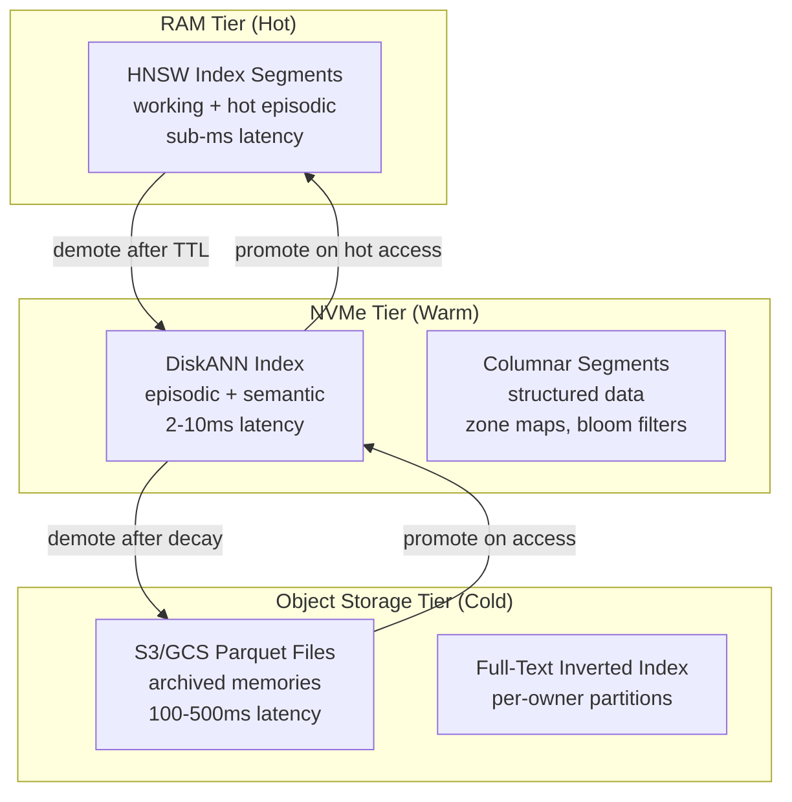

**Tier promotion/demotion rules:**

| Trigger | Action |
|---------|--------|
| Memory type transitions from `working` to `episodic` | Demote from RAM to NVMe |
| Confidence drops below 0.1 | Demote to object storage |
| `RECALL` hits an object-storage memory | Promote to NVMe cache |
| Memory accessed >3 times in 1 hour | Promote to RAM (hot cache) |
| Not accessed for 24h in RAM | Demote to NVMe |

This borrows TurboPuffer's tiered caching philosophy but applies it **semantically** — the memory type itself determines the initial tier, not just access frequency.

---

### 4. Segmented HNSW (from Pain Points #4, #5)

**Problem:** A single global HNSW graph is:
- **Expensive to update:** Every insertion requires graph traversal + edge updates → read-write contention
- **Not multi-tenant:** All agents share one graph → ACL is impossible at the index level
- **Not version-safe:** Model upgrades invalidate the entire graph

**Revised design:** Segmented HNSW, inspired by LSM-tree architecture:

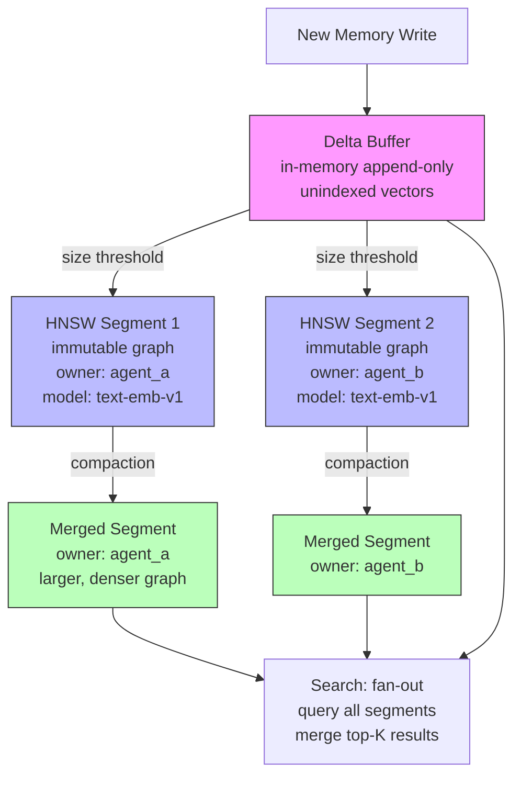

**Segment properties:**
- Each segment is **immutable** after creation — no read-write contention
- Segments are partitioned by `(owner_id, model_name, model_version)` — ACL is enforced at the segment level
- New inserts go to an **in-memory delta buffer** (unindexed, brute-force search)
- When the delta buffer exceeds a threshold, it's flushed to a new immutable HNSW segment
- Background **compaction** merges small segments into larger ones (like LSM-tree compaction)
- **Search** fans out to all segments + delta buffer, merges top-K results

**Compaction strategy:**

| Level | Segment Count Threshold | Max Segment Size | Action |
|-------|------------------------|------------------|--------|
| L0 (delta) | 1 buffer | 10K vectors | Flush to L1 |
| L1 | 4 segments | 100K vectors | Merge to L2 |
| L2 | 4 segments | 1M vectors | Merge to L3 |
| L3 | Unlimited | 10M vectors | Stable, no further merge |

**Impact on ACL:** Since each segment belongs to one `(owner_id, model_name, model_version)`, the partition pruner can skip entire segments based on ACL. No post-filter needed for agent-level isolation.

---

### 5. Async Ingest Pipeline (from Pain Point #6)

**Problem:** The original `REMEMBER` SQL primitive assumed synchronous embedding generation. But embedding requires ML inference (10-50ms per call). For high-throughput agent workloads (e.g., an agent processing 100 messages/minute), synchronous embedding becomes the bottleneck.

**Revised design:** Two-phase async ingest:

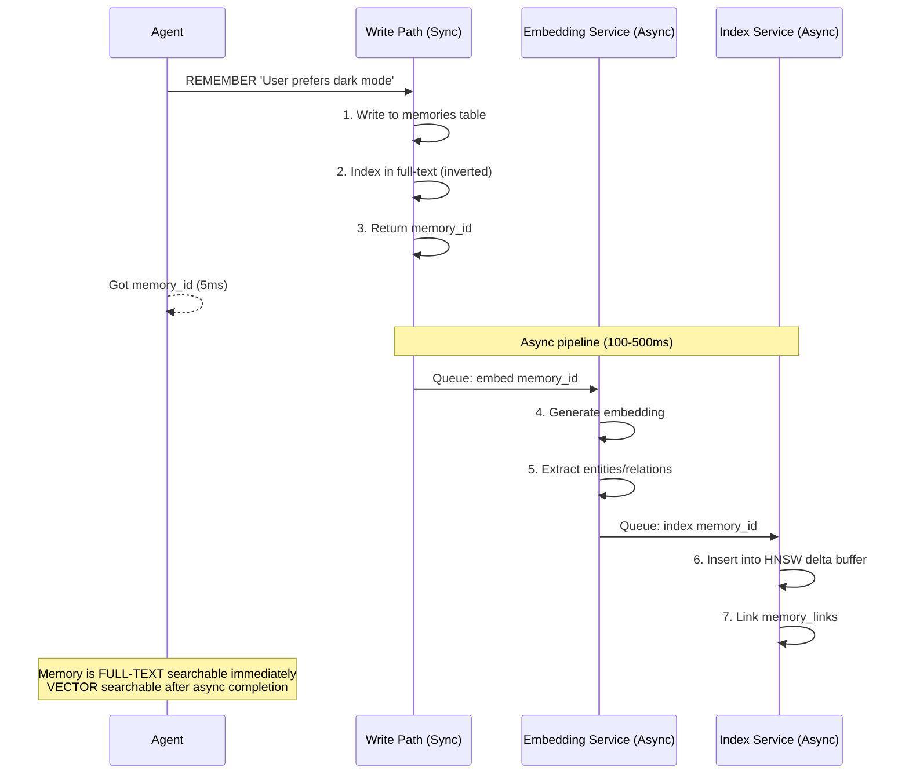

**Two-phase searchability:**

| Phase | Time after REMEMBER | Searchable By | Not Yet Searchable By |
|-------|-------------------|--------------|----------------------|
| Phase 1 (sync) | 0-5ms | Full-text, structured filters | Vector similarity, entity graph |
| Phase 2 (async) | 100-500ms | Vector similarity, entity graph, memory_links | — |

**Memory status tracking:**
```sql
ALTER TABLE memories ADD COLUMN index_status VARCHAR NOT NULL DEFAULT 'pending'
    CHECK (index_status IN ('pending', 'embedding', 'indexed', 'error'));
```

Queries against `pending` or `embedding` memories fall back to full-text + structured filters. Once `index_status = 'indexed'`, the memory participates in vector search.

**`REMEMBER` returns immediately** with the memory_id and a status indicator. The agent can optionally wait for indexing completion, or proceed knowing the memory will be vector-searchable shortly.

---

### 6. Chunk-Entity Hierarchy (from Pain Point #8)

**Problem:** The original data model treats each memory as a flat, independent unit. But memories have natural hierarchical composition:

- A **working memory** (conversation turn) contains **multiple facts** (chunks)
- An **episodic memory** (interaction summary) is composed from **multiple working memories**
- A **semantic memory** (learned fact) may be **derived from** multiple episodes
- Search finds chunks, but the agent needs to recall the **parent context**

**Revised design:** New `memory_chunks` table for hierarchical composition:

```sql
CREATE TABLE memory_chunks (
    id              UUID PRIMARY KEY,
    memory_id       UUID NOT NULL REFERENCES memories(id) ON DELETE CASCADE,
    chunk_order     INT NOT NULL,            -- ordering within parent memory
    chunk_text      TEXT NOT NULL,
    chunk_embedding VARBINARY,               -- per-chunk embedding (stored in memory_embeddings)
    entity_type     VARCHAR,                 -- 'fact', 'preference', 'event', 'instruction'
    entity_data     JSONB,                   -- extracted structured data: {key, value, confidence}
    source_chunk_id UUID REFERENCES memory_chunks(id), -- for consolidation: which chunk(s) this was derived from
    
    INDEX (memory_id, chunk_order)
);
```

**Hierarchy flow:**

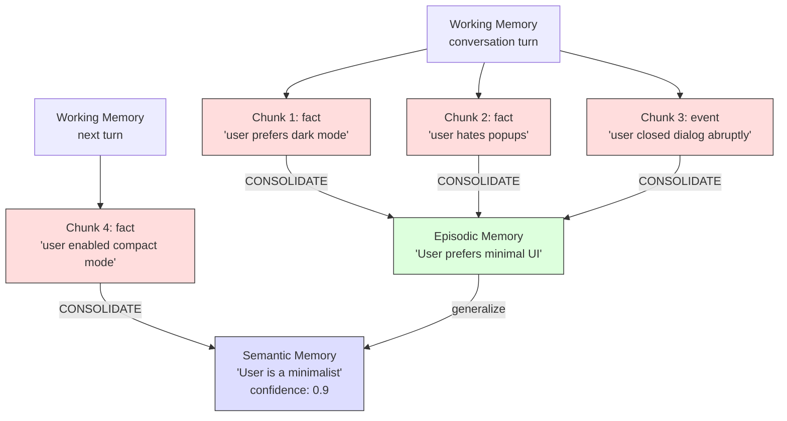

**Search semantics:**

| Search Level | Returns | Aggregation |
|-------------|---------|-------------|
| Chunk-level | Most granular match | `GROUP BY memory_id` to get parent context |
| Memory-level | Parent memory with best chunk score | `MAX(chunk_score)` per memory |
| Cross-memory | Related memories via `memory_links` | Follow `derived_from` edges |

**CONSOLIDATE revisited:**
```sql
-- Consolidation now creates new memories from chunks, preserving lineage
CONSOLIDATE MEMORIES 
  WHERE owner_id = CURRENT_AGENT
  AND memory_type = 'working'
  AND created_at > NOW() - INTERVAL '1 hour'
  INTO memory_type = 'episodic';
-- Internally:
--   1. Cluster working memory chunks by topic similarity
--   2. Summarize each cluster → new episodic memory
--   3. Link episodic chunks to source working chunks via source_chunk_id
--   4. Mark working memories as 'consolidated' (not deleted — lineage preserved)
```

---

### Revised Data Model (Complete)

The original `memories` table is revised. Key changes highlighted with `-- CHANGED`:

```sql
-- The core memory unit (REVISED)
CREATE TABLE memories (
    id              UUID PRIMARY KEY,
    
    -- Who and what
    owner_id        VARCHAR NOT NULL,
    owner_partition SMALLINT NOT NULL,       -- CHANGED: hash(owner_id) for physical partitioning
    memory_type     VARCHAR NOT NULL,       -- 'working', 'episodic', 'semantic', 'procedural', 'archived'
    
    -- Content
    content         TEXT NOT NULL,
    -- REMOVED: embedding VECTOR(1536) -- moved to memory_embeddings table
    entities        JSONB,
    relations       JSONB,
    
    -- Storage tiering -- CHANGED: new columns
    storage_tier    VARCHAR NOT NULL DEFAULT 'nvme'
        CHECK (storage_tier IN ('ram', 'nvme', 'object')),
    index_status    VARCHAR NOT NULL DEFAULT 'pending'
        CHECK (index_status IN ('pending', 'embedding', 'indexed', 'error')),
    
    -- Time
    created_at      TIMESTAMP NOT NULL,
    accessed_at     TIMESTAMP,
    expires_at      TIMESTAMP,
    
    -- Confidence & Importance
    confidence      FLOAT DEFAULT 1.0,
    importance      FLOAT DEFAULT 0.5,
    
    -- Provenance
    source_type     VARCHAR,
    source_agent_id  VARCHAR,
    source_turn_id  VARCHAR,
    
    -- Versioning
    version         INT DEFAULT 1,
    superseded_by   UUID REFERENCES memories(id),
    
    -- Indexes
    FULLTEXT INDEX(content)
    -- NOTE: Vector index is on memory_embeddings table, segmented by (owner_id, model_name)
);

-- Multi-model embeddings (NEW TABLE)
CREATE TABLE memory_embeddings (
    id              UUID PRIMARY KEY,
    memory_id       UUID NOT NULL REFERENCES memories(id) ON DELETE CASCADE,
    model_name      VARCHAR NOT NULL,
    model_version   VARCHAR NOT NULL,
    embedding_type  VARCHAR NOT NULL,       -- 'dense', 'sparse', 'multi_modal'
    dimension       INT NOT NULL,
    embedding       VARBINARY NOT NULL,
    created_at      TIMESTAMP NOT NULL,
    is_current      BOOLEAN DEFAULT TRUE,
    
    INDEX (memory_id, model_name, model_version),
    VECTOR INDEX (embedding) WHERE is_current = TRUE
        PARTITION BY model_name
);

-- Hierarchical chunks (NEW TABLE)
CREATE TABLE memory_chunks (
    id              UUID PRIMARY KEY,
    memory_id       UUID NOT NULL REFERENCES memories(id) ON DELETE CASCADE,
    chunk_order     INT NOT NULL,
    chunk_text      TEXT NOT NULL,
    chunk_embedding VARBINARY,
    entity_type     VARCHAR,
    entity_data     JSONB,
    source_chunk_id UUID REFERENCES memory_chunks(id),
    
    INDEX (memory_id, chunk_order)
);

-- Access control (UNCHANGED from original)
CREATE TABLE memory_acls (
    memory_id       UUID REFERENCES memories(id),
    grantor_id       VARCHAR NOT NULL,
    grantee_id       VARCHAR NOT NULL,
    permission       VARCHAR NOT NULL,
    scope            VARCHAR NOT NULL,
    conditions       JSONB,
    granted_at       TIMESTAMP NOT NULL,
    expires_at       TIMESTAMP,
    revoked_at       TIMESTAMP
);

-- Memory links (UNCHANGED from original)
CREATE TABLE memory_links (
    source_id        UUID REFERENCES memories(id),
    target_id        UUID REFERENCES memories(id),
    link_type         VARCHAR NOT NULL,
    confidence       FLOAT DEFAULT 1.0,
    created_at       TIMESTAMP NOT NULL
);

-- Memory access log (UNCHANGED from original)
CREATE TABLE memory_access_log (
    memory_id        UUID REFERENCES memories(id),
    agent_id         VARCHAR NOT NULL,
    access_type      VARCHAR NOT NULL,
    query_context    TEXT,
    relevance_score  FLOAT,
    accessed_at      TIMESTAMP NOT NULL
);
```

---

### Updated Architecture

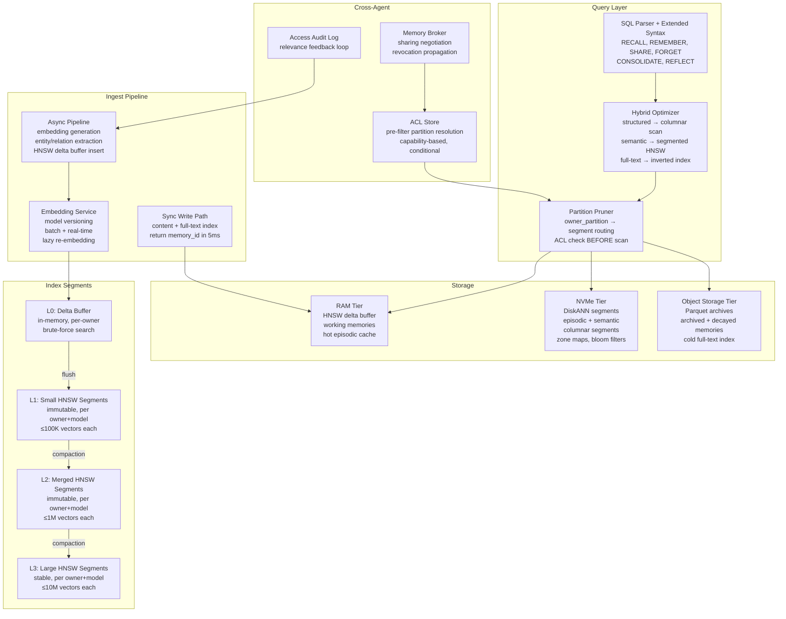

---

### Updated Build Order (Revised)

The original 6-phase build order must account for the pain-point-driven design changes:

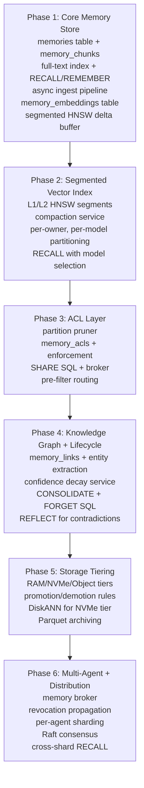

Key changes from original build order:
- **Phase 1** now includes `memory_chunks`, `memory_embeddings`, and the async ingest pipeline (originally deferred)
- **Phase 2** is new: segmented HNSW was originally part of Phase 1 but is now its own phase due to complexity
- **Phase 3** (ACL) now includes the partition pruner architecture
- **Phase 5** (Storage Tiering) is new: originally not a separate phase
- Phases 4 and 6 are largely unchanged but shifted later