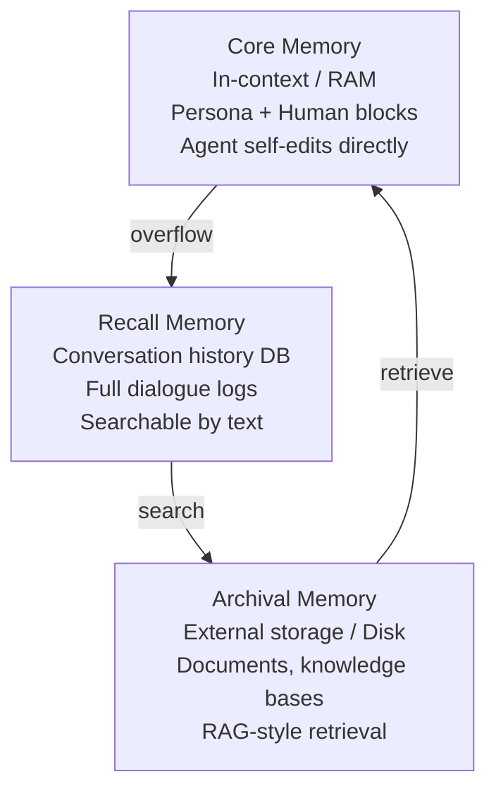
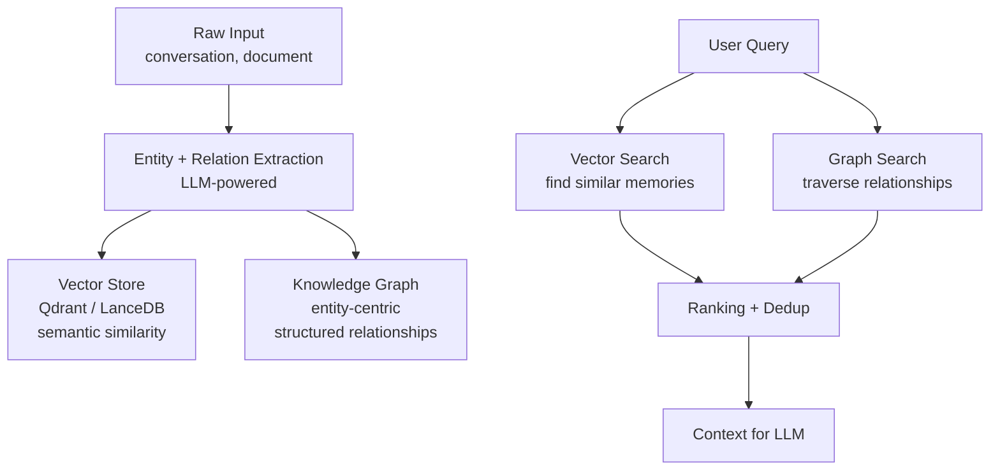
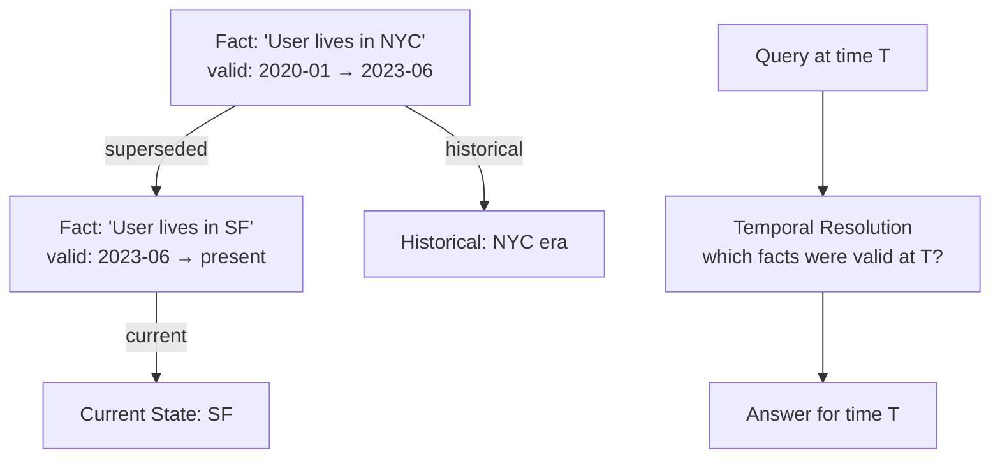
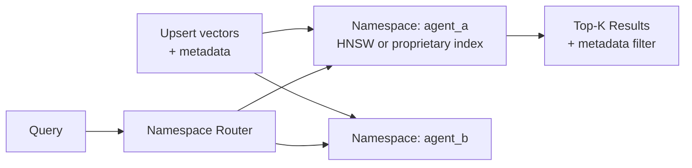
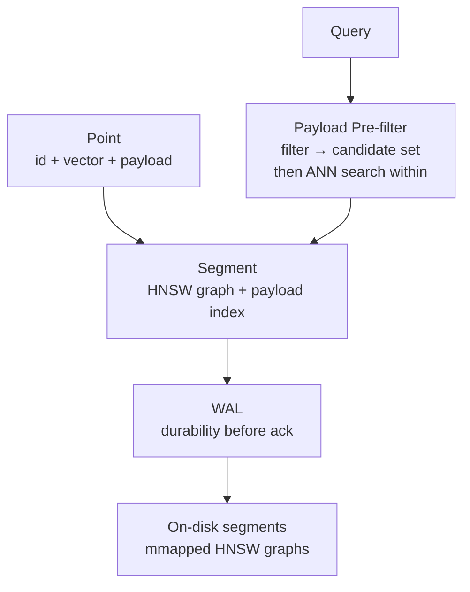
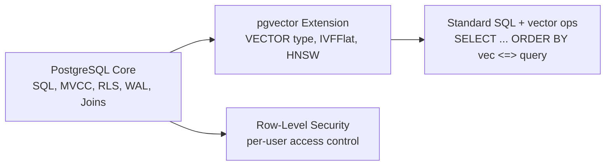
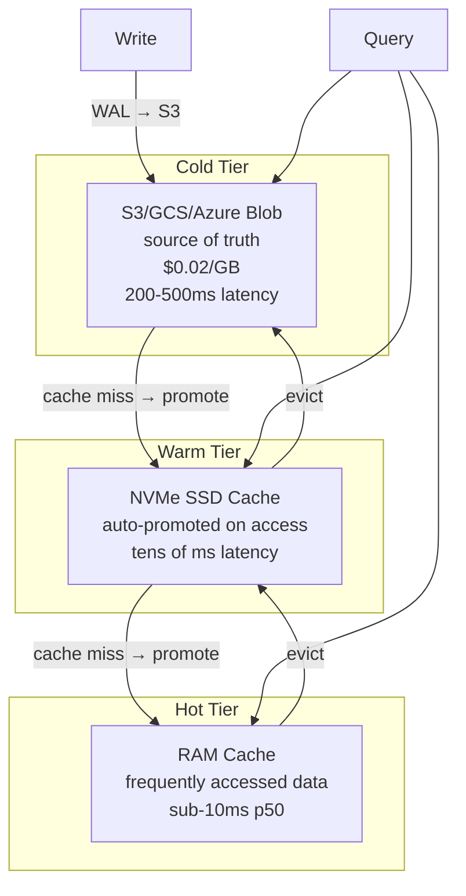

# Existing Systems Comparison: Agent Memory Database Requirements

How existing systems compare against the requirements for an AI agent memory database, what they each do well, what's missing, and what architectural patterns to borrow.

---

## Why This Comparison Matters

No existing system fulfills all the requirements of an AI agent memory database. However, several systems solve **subsets** of the problem exceptionally well. Understanding their architectures reveals:

1. **Proven patterns** worth reusing (not reinventing)
2. **Structural gaps** that justify building something new
3. **Architectural traps** to avoid (approaches that seem right but don't scale)

Our 14 requirements (from `ai-agent-memory-database.md`):

| # | Requirement | Why It Matters |
|---|-----------|---------------|
| 1 | Vector search | Semantic similarity retrieval |
| 2 | Structured filter | Metadata + attribute queries |
| 3 | Full-text search | Keyword + phrase matching |
| 4 | Confidence decay | Memory fading over time |
| 5 | Memory versioning | Superseded memories, lineage |
| 6 | Agent ACL | Multi-tenant access control |
| 7 | Conditional sharing | Scope-limited, filter-based ACL |
| 8 | Conflict detection | Contradicting memories |
| 9 | Consolidation | Working → episodic → semantic promotion |
| 10 | Access audit | Relevance feedback loop |
| 11 | Multi-modal embeddings | Text + image + audio + sparse |
| 12 | Chunk-entity hierarchy | Document → chunk → fact composition |
| 13 | Model versioning | Embedding model lifecycle |
| 14 | Storage tiering | RAM/NVMe/object placement by memory type |

---

## Systems Analyzed

### 1. Letta (formerly MemGPT)

**Architecture:** Models an AI agent as a virtual operating system (LLM-OS) with three memory tiers, where the agent self-manages its own memory like an OS manages RAM and disk.

**Memory Tiers:**



| Tier | Analogy | Storage | Agent Action |
|------|---------|---------|-------------|
| **Core** | RAM | LLM context window | Self-edit with `core_memory_append`, `core_memory_replace` |
| **Recall** | Conversation log | Postgres/SQLite | Search with `conversation_search`, `archival_memory_search` |
| **Archival** | Disk / external | Postgres/SQLite + vector index | Insert with `archival_memory_insert`, search with `archival_memory_search` |

**Key innovation:** The agent has **built-in tools** to manage its own memory. It decides when to move information between tiers, when to search Recall, when to store in Archival. This is fundamentally different from passive RAG — the agent is an **active memory manager**.

**Storage:** All state persisted in Postgres or SQLite. Agent configuration, memory blocks, message threads, and tool states survive restarts.

**Strengths:**
- Self-editing memory with tool-calling (agent controls its own memory)
- Persistent state across restarts
- Clean separation of concerns (core/recall/archival)
- Model-agnostic (OpenAI, Anthropic, etc.)

**Weaknesses:**
- No multi-tenant ACL — all agents share the same DB with no access control between them
- No model versioning for embeddings
- No conflict detection or resolution
- Single embedding model — no multi-modal support
- No confidence decay — memories don't fade
- Core memory is limited by context window size
- No hierarchical chunk-entity model
- Recall memory is just conversation logs, not structured episodic memory

**What to borrow:**
- The **memory tier concept** maps directly to our working/episodic/semantic/procedural types
- The **agent-as-active-memory-manager** pattern — agents should have tools to consolidate, reflect, and forget, not just read/write
- The **self-editing core memory** pattern for our working memory (agent can modify its own active context)

---

### 2. Mem0

**Architecture:** Dual-store system combining vector similarity search with a knowledge graph for structured entity-relationship memory.



**Memory model:**
- Each memory is a **triple**: (entity, relation, entity) with metadata
- Vectors provide semantic recall; graph provides structured traversal
- Memories are deduplicated automatically — similar facts get merged, not duplicated
- Graph edges carry relationship semantics ("prefers", "works_at", "is_a")

**Storage:** Qdrant or LanceDB for vectors, custom graph store (moving away from Neo4j dependency).

**Strengths:**
- Dual-store pattern (vector + graph) is the right idea for structured + semantic memory
- Automatic deduplication prevents memory bloat
- Entity-centric model maps well to "user preferences" and "world knowledge"
- Graph traversal enables multi-hop reasoning ("user works at X → X uses Y → user likely knows Y")

**Weaknesses:**
- No ACL — any agent can read any memory
- No confidence decay or memory lifecycle
- No conditional sharing or scoping
- No model versioning for embeddings
- No chunk-entity hierarchy (memories are flat triples)
- No conflict resolution beyond dedup
- Graph store is a separate system — operational complexity

**What to borrow:**
- The **dual-store pattern** validates our separate vector index + `memory_links` approach
- **Entity + relation extraction at ingest** — we should extract structured triples when memories are stored
- **Automatic deduplication** — our `superseded_by` field serves this purpose, but Mem0's similarity-based merge is worth studying

---

### 3. Zep / Graphiti

**Architecture:** Temporal knowledge graph where edges carry **validity intervals** — each fact is true for a specific time range, and contradictions are resolved by temporal ordering.



**Key innovation:** **Temporal edges**. Every relationship in the graph has `valid_at` and `invalid_at` timestamps. This means:
- You can query "what was true on 2023-01-15?" and get the correct answer
- Contradictions are resolved by time: newer facts supersede older ones
- Historical knowledge is preserved (not deleted), just marked as no longer current

**Storage:** Neo4j or custom temporal property graph engine.

**Strengths:**
- Temporal validity is the **most natural model** for memory conflict resolution
- Preserves history — never deletes, only marks as superseded
- Enables time-travel queries ("what did I believe last month?")
- Clean model for handling user preference changes

**Weaknesses:**
- No vector search — purely graph-based retrieval
- No structured attribute filtering
- No ACL or multi-tenant access control
- No embedding model management
- No multi-modal support
- No chunk hierarchy
- No confidence decay (time replaces confidence, which is incomplete)

**What to borrow:**
- **Temporal validity intervals** on `memory_links` — instead of just `superseded_by`, add `valid_from` and `valid_until` to our link edges
- **Time-travel queries** as a SQL extension: `RECALL AT TIMESTAMP '2024-06-01'` to retrieve memories valid at a past time
- **Never-delete philosophy** — conflicts produce new versions, not deletions; our `superseded_by` field aligns with this

---

### 4. Pinecone

**Architecture:** Pure vector index with namespace-based multi-tenancy and metadata filtering.



**Key properties:**
- Namespaces provide **soft isolation** between tenants
- Metadata filtering pre-filters before vector search
- Serverless option (no cluster management)
- Sparse-dense hybrid vectors (alpha release)

**Strengths:**
- Dead simple API — upsert, query, delete
- Serverless model removes ops burden
- Namespaces are a clean multi-tenancy primitive
- Metadata filtering integrates with vector search

**Weaknesses:**
- No structured query language (no SQL)
- No full-text search
- No ACL beyond namespace isolation
- No memory lifecycle, confidence, versioning
- No entity extraction or knowledge graph
- No embedding generation — client must provide vectors
- No model versioning
- Vendor lock-in (proprietary cloud service)

**What to borrow:**
- **Namespace-based multi-tenancy** maps to our `owner_partition` concept — physical isolation between agents' vector segments
- **Metadata pre-filtering** validates our ACL-as-pre-filter approach — filter before search, not after

---

### 5. Weaviate

**Architecture:** Vector-first database with GraphQL API, modular embedding pipeline (modules), and inverted index for hybrid search.

```mermaid
graph TD
    DATA[Data Object<br/>properties + vector] --> STORE[Weaviate Store<br/>HNSW index + inverted index]
    STORE --> MODULES[Modules System<br/>text2vec-openai, img2vec, etc.]
    MODULES -->|auto-embed| STORE
    
    QUERY_GQL[GraphQL Query] --> HYBRID[Hybrid Search<br/>vector + keyword (BM25)]
    HYBRID --> STORE
```

**Key innovation:** **Modules** plug into the ingest/query pipeline. A `text2vec-openai` module auto-embeds text at ingest. An `img2vec` module handles images. Modules are composable — one collection can use different modules for different fields.

**Strengths:**
- Module system is the most flexible embedding architecture among vector DBs
- Hybrid search (vector + BM25) in one query
- GraphQL provides structured access to vector + properties
- Auto-embedding at ingest (if modules are configured)
- Multi-tenancy via per-request tenant headers

**Weaknesses:**
- Structured filtering is limited (no SQL, no joins)
- ACL is API-key level only, not fine-grained
- No confidence decay or memory lifecycle
- No conflict resolution
- No chunk-entity hierarchy
- Model versioning is implicit (changing a module doesn't re-embed existing data)
- HNSW requires vectors in RAM at index time

**What to borrow:**
- **Module system architecture** — our embedding service should support pluggable model backends like Weaviate modules
- **Hybrid search (vector + BM25)** validates our three-way hybrid: structured + vector + full-text
- **Auto-embedding at ingest** — but we must make it async to avoid blocking writes

---

### 6. Qdrant

**Architecture:** Rust-based vector database with HNSW, payload filtering, and WAL for durability.



**Key properties:**
- Written in Rust — no GC pauses, predictable latency
- Payload indexes (keyword, integer, geo) enable structured filtering
- WAL ensures durability — writes are committed before acknowledgment
- Segmented storage with background optimization
- Supports sparse vectors (BM25-like)

**Strengths:**
- **Rust implementation** proves that high-performance vector search is possible without C++
- **Payload pre-filtering** with indexed fields — fast structured + vector hybrid
- WAL for durability — no data loss on crash
- Segmented architecture enables background optimization without blocking reads
- Sparse vector support for hybrid search

**Weaknesses:**
- No full-text search (BM25 sparse vectors are not the same as inverted index search)
- No ACL beyond API-key authentication
- No memory lifecycle, confidence, versioning
- No knowledge graph or entity extraction
- No model versioning
- No chunk-entity hierarchy
- No embedding generation (client-provided vectors only)

**What to borrow:**
- **Rust as implementation language** — validates our rewrite assessment (from `database-foundations.md`)
- **WAL for vector writes** — our async ingest pipeline should WAL-log the pending embedding request before acknowledging the REMEMBER
- **Segmented storage with background optimization** maps directly to our L0/L1/L2/L3 HNSW segment compaction
- **Payload pre-filtering** validates our ACL-as-pre-filter approach

---

### 7. pgvector / pgvecto.rs

**Architecture:** PostgreSQL extension that adds VECTOR column type and ANN indexes (IVFFlat, HNSW) to the standard Postgres engine.



**Key insight:** pgvector proves that **vector search can be a SQL extension**, not a separate system. You get all of Postgres (joins, transactions, MVCC, RLS) plus vector similarity in one query.

**Strengths:**
- Full SQL with joins, aggregations, subqueries
- Row-Level Security (RLS) provides per-row ACL
- MVCC for concurrent reads and writes
- WAL for durability
- ACID transactions
- pgvecto.rs (Rust extension) offers better HNSW performance

**Weaknesses:**
- IVFFlat/HNSW indexes don't scale well past 10M vectors (brute-force at scale)
- RLS is row-level, not field-level (can't hide embeddings while showing content)
- No embedding generation — client must provide vectors
- No model versioning
- No memory lifecycle or confidence decay
- No knowledge graph (would need separate extension)
- No full-text + vector + structured hybrid optimization (each is handled independently by the planner)
- HNSW index rebuild is expensive on large tables
- No async ingest — embedding column must be populated at write time

**What to borrow:**
- **SQL-native vector operations** — our `VECTOR_DISTANCE()`, `EMBED()`, and SQL primitives (`RECALL`, `REMEMBER`) follow this philosophy
- **Row-Level Security as ACL model** — but we need field-level (scope-based) ACL, which Postgres RLS cannot do
- **MVCC for concurrent access** — our storage layer should use MVCC for the columnar store
- The key lesson: **extending an existing SQL engine is faster than building from scratch**, but only if the engine's architecture accommodates the extension. Postgres' row-oriented storage is fundamentally mismatched for large-scale vector work.

---

### 8. TurboPuffer

**Architecture:** Serverless vector and full-text search engine built on object storage (S3/GCS) with automatic tiered caching.



**Key innovation:** **Object storage as the source of truth.** Unlike traditional vector databases that keep everything in RAM or on local SSDs, TurboPuffer stores all data in S3 and only caches what's actively queried. This dramatically reduces cost (10-100x cheaper) while maintaining acceptable latency for active data.

**Index:** Uses **SPFresh** (centroid-based ANN) instead of HNSW. Centroid indexes are more object-storage-friendly because they require fewer random reads and less write amplification.

**Consistency:** Strong consistency by default — writes are WAL-logged to object storage before acknowledgment. Eventually consistent option available for lower latency.

**Strengths:**
- Extreme cost efficiency for large datasets
- Automatic tiered caching (cold/warm/hot)
- Full-text search (BM25 inverted index) alongside vector search
- Strong consistency on object storage
- Stateless compute nodes (Rust) — easy to scale
- Multi-tenancy via namespaces
- Handles datasets that don't fit in RAM

**Weaknesses:**
- No structured query language (API-only)
- No ACL beyond namespace isolation
- No memory lifecycle, confidence, versioning
- No knowledge graph or entity extraction
- No embedding generation
- No model versioning
- Latency for cold queries is high (200-500ms)
- SPFresh is less accurate than HNSW for high-recall workloads

**What to borrow:**
- **Object-storage-first architecture** validates our cold tier (archived memories on S3/GCS)
- **Automatic tier promotion/demotion** — our storage tiering should use access patterns, not just memory type
- **SPFresh centroid index** as an alternative to HNSW for object-storage-resident vectors (lower write amplification)
- **Stateless compute nodes** — our query layer should be stateless for horizontal scaling
- **WAL on object storage with strong consistency** — proves this pattern is viable

---

## Feature Comparison Matrix

| Requirement | Letta | Mem0 | Zep | Pinecone | Weaviate | Qdrant | pgvector | TurboPuffer |
|-------------|-------|------|-----|----------|----------|--------|----------|-------------|
| 1. Vector search | partial | ✓ | ✗ | ✓ | ✓ | ✓ | partial | ✓ |
| 2. Structured filter | ✗ | ✗ | ✗ | partial | partial | ✓ | ✓ | ✗ |
| 3. Full-text search | partial | ✗ | ✗ | ✗ | ✓ | partial | ✓ | ✓ |
| 4. Confidence decay | ✗ | ✗ | ✗ | ✗ | ✗ | ✗ | ✗ | ✗ |
| 5. Memory versioning | ✗ | ✗ | partial | ✗ | ✗ | ✗ | ✗ | ✗ |
| 6. Agent ACL | ✗ | ✗ | ✗ | partial | partial | partial | ✓ | partial |
| 7. Conditional sharing | ✗ | ✗ | ✗ | ✗ | ✗ | ✗ | ✗ | ✗ |
| 8. Conflict detection | ✗ | ✗ | partial | ✗ | ✗ | ✗ | ✗ | ✗ |
| 9. Consolidation | partial | ✗ | ✗ | ✗ | ✗ | ✗ | ✗ | ✗ |
| 10. Access audit | ✗ | ✗ | ✗ | ✗ | ✗ | ✗ | partial | ✗ |
| 11. Multi-modal embeddings | ✗ | ✗ | ✗ | ✗ | ✓ | partial | ✗ | ✗ |
| 12. Chunk-entity hierarchy | ✗ | ✗ | ✗ | ✗ | ✗ | ✗ | ✗ | ✗ |
| 13. Model versioning | ✗ | ✗ | ✗ | ✗ | partial | ✗ | ✗ | ✗ |
| 14. Storage tiering | partial | ✗ | ✗ | ✗ | ✗ | ✗ | ✗ | ✓ |

**Score summary:**

| System | Requirements Met | Score |
|--------|-----------------|-------|
| Letta | 2.5 / 14 | 18% |
| Mem0 | 1 / 14 | 7% |
| Zep | 1.5 / 14 | 11% |
| Pinecone | 1.5 / 14 | 11% |
| Weaviate | 4 / 14 | 29% |
| Qdrant | 2.5 / 14 | 18% |
| pgvector | 3.5 / 14 | 25% |
| TurboPuffer | 2 / 14 | 14% |
| **Agent Memory DB (target)** | **14 / 14** | **100%** |

No system exceeds 29%. The gap is not incremental — it's structural.

---

## Gap Analysis

### What No System Provides

1. **Structured + Vector + Full-text hybrid query in one engine**
   - pgvector comes closest (SQL + partial vector + full-text) but vector performance degrades at scale
   - Weaviate has vector + BM25 but weak structured filtering
   - Nobody does all three well

2. **Capability-based ACL with conditional scoping**
   - pgvector's RLS is row-level, not field-level (can't scope to `content` vs `embedding` vs `entities`)
   - Pinecone/Qdrant namespaces are tenant-level isolation, not fine-grained ACL
   - No system supports JSONB conditions like `"min_confidence": 0.7, "memory_type": "semantic"`

3. **Memory lifecycle (confidence decay + consolidation + conflict resolution)**
   - Only Letta has a partial lifecycle (core → recall → archival) but no confidence decay or conflict detection
   - Zep has temporal supersession but no decay or consolidation
   - No system ties lifecycle to storage tiering

4. **Multi-model embedding versioning with lazy migration**
   - Weaviate modules support switching models, but existing data isn't re-embedded
   - Nobody tags each embedding with `(model_name, model_version)`
   - Nobody supports `is_current` flag for graceful model transitions

5. **Chunk-entity-document hierarchy with cross-level search**
   - No system stores hierarchical composition (chunk → memory → consolidated memory)
   - RAG systems chunk documents but don't maintain roll-up relationships
   - No system supports search at chunk level with aggregation to memory/document level

6. **Storage tiering driven by memory type semantics**
   - Only TurboPuffer has automatic tiered caching, but it's based on access frequency, not memory semantics
   - Letta has tier placement (core/recall/archival) but it's manual, not automated
   - No system maps memory type (working/episodic/semantic) to storage tier (RAM/NVMe/object)

### The Compound Effect

Each individual gap is addressable by extending an existing system. But the **combination** creates a qualitatively different system:

- ACL without lifecycle → agents can share memories that should have decayed
- Vector search without model versioning → model upgrades break all similarity rankings
- Consolidation without hierarchy → generalized memories lose their source context
- Tiering without memory semantics → hot cache wastes RAM on stale episodic memories

These interactions mean **composing N existing systems doesn't work**. The integration complexity of gluing Pinecone + Postgres + Letta + Mem0 + a custom lifecycle engine exceeds the cost of building one coherent system.

---

## Architectural Lessons Summary

| Source System | Pattern | Our Adoption |
|--------------|---------|-------------|
| **Letta/MemGPT** | Memory tiering (core/recall/archival) | Maps to our working/episodic/semantic/procedural types → storage tier |
| **Letta/MemGPT** | Agent as active memory manager (self-editing tools) | Our SQL primitives: CONSOLIDATE, REFLECT, FORGET |
| **Mem0** | Dual-store: vector DB + knowledge graph | Our segmented HNSW + `memory_links` table |
| **Mem0** | Automatic entity extraction at ingest | Our async ingest pipeline step 5 (extract entities/relations) |
| **Zep/Graphiti** | Temporal validity intervals on edges | Add `valid_from`/`valid_until` to `memory_links` |
| **Zep/Graphiti** | Never-delete, only supersede | Our `superseded_by` field + time-travel queries |
| **Pinecone** | Namespace-based multi-tenancy | Our `owner_partition` for physical segment isolation |
| **Weaviate** | Pluggable module system for embeddings | Our embedding service with model registry |
| **Weaviate** | Hybrid search (vector + BM25) | Our three-way hybrid: structured + vector + full-text |
| **Qdrant** | Rust implementation | Validates Rust as our implementation language |
| **Qdrant** | WAL for durability | Our async ingest WAL-logs pending embeddings |
| **Qdrant** | Segmented storage + background optimization | Our L0-L3 HNSW segment compaction |
| **pgvector** | SQL-native vector operations | Our SQL extension philosophy (VECTOR_DISTANCE, EMBED, RECALL) |
| **pgvector** | Row-Level Security | Starting point for our capability-based ACL (but we need field-level scoping) |
| **pgvector** | MVCC for concurrent access | Our columnar store should implement MVCC |
| **TurboPuffer** | Object-storage-first with tiered caching | Our cold tier architecture (archived memories on S3/GCS) |
| **TurboPuffer** | Automatic tier promotion/demotion | Our storage tiering rules (access-driven + memory-type-driven) |
| **TurboPuffer** | SPFresh centroid index for object storage | Alternative to HNSW for cold-tier vectors (lower write amplification) |
| **TurboPuffer** | Stateless compute + strong consistency | Our stateless query layer + WAL before ack |

### The合成 (Synthesis)

The agent memory database is not a mashup of existing systems. It's a **synthesis** that takes the best architectural insights from each and integrates them into a coherent whole:

- From **Letta**: the agent should **actively manage** its memory, not passively store and retrieve
- From **Mem0**: vector search and graph traversal must **coexist** in the same query
- From **Zep**: time is the most natural **conflict resolution** mechanism
- From **Qdrant**: Rust + WAL + segments = a **durable, fast, predictable** foundation
- From **pgvector**: SQL is the right **interface** — agents and humans both speak it
- From **TurboPuffer**: object storage + tiered caching = **cost-efficient scale**

What none of them have: the **semantic awareness** that memory type drives storage tiering, ACL scoping, lifecycle decisions, and index segment placement. This is the novel contribution of the agent memory database design.