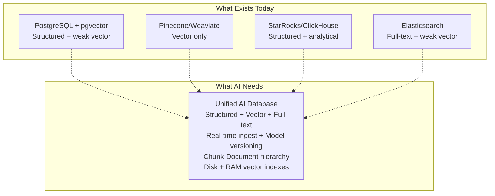

# AI Database Pain Points & Architecture

The 8 unsolved problems that no existing database fully addresses, and the architectural opportunity they create.

## The 8 Pain Points

### 1. The Hybrid Query Problem
AI apps need **structured + vector + full-text** in one query:

```sql
-- This doesn't exist in any single system today
SELECT id, content, embedding 
  FROM documents 
 WHERE category = 'finance'              -- structured filter
   AND publish_date > '2024-01-01'       -- structured filter
   AND content MATCHES 'market outlook'   -- full-text search
 ORDER BY embedding <-> '[0.12, -0.34, ...]'  -- vector similarity
 LIMIT 20;
```

StarRocks can do structured + full-text. Pinecone can do vector. **Nobody does all three well in one engine.**

### 2. Embedding Pipeline Complexity
Embeddings don't exist in a vacuum — they must be **generated, versioned, and updated**:

```
Raw Data → Embedding Model → Vector → Index → Query
                ↑
           Model version matters!
```

Pain: When you upgrade your embedding model, **every vector becomes stale**. You must re-embed your entire corpus. No database handles this versioning natively.

### 3. Storage Format Mismatch
Columnar storage (StarRocks, ClickHouse) is optimal for analytics but **terrible for vector similarity**:

| Operation | Columnar excels | Vector index excels |
|-----------|----------------|-------------------|
| `SUM(revenue)` | ✓ sequential column scan | ✗ |
| `WHERE year = 2024` | ✓ zone map pruning | ✗ |
| `ORDER BY vec <-> query` | ✗ must scan all vectors | ✓ HNSW/DiskANN graph traversal |

You need **two storage subsystems that cooperate**: columnar for structured data, graph-based for ANN search. This is architecturally hard.

### 4. Memory vs Disk for Vector Indexes
HNSW (Hierarchical Navigable Small World) gives sub-millisecond ANN search but requires vectors in memory. At 1 billion vectors × 1536 dimensions × float32 = **5.7 TB of RAM**.

DiskANN stores vectors on disk with product quantization, but latency is 2-5ms vs 0.1ms for HNSW.

**No system gracefully handles the spectrum from "fits in RAM" to "must be on disk."**

### 5. Real-Time Vector Index Updates
Traditional ANN indexes (HNSW, IVF-PQ) are **built offline**. When you insert new vectors:
- HNSW: Must update the graph → expensive, causes read-write contention
- IVF-PQ: Must retrain quantizers periodically → even more expensive

**The write path for vectors is fundamentally harder than the write path for structured data.**

### 6. Inference Cost at Ingest
Every insert might require running an embedding model:

```
INSERT INTO documents (content) VALUES ('some text...');
-- ↑ This insert must ALSO:
--   1. Call embedding model (GPU/CPU inference, 10-50ms)
--   2. Store the vector
--   3. Update the ANN index
```

This turns every INSERT into an **ML inference call**. Existing databases assume INSERT is cheap; AI databases cannot.

### 7. Multi-Modal Embedding Management
A single document might have **multiple embedding spaces**:

```
Text → text-embedding-3-large (3072d)
Text → BM25 sparse vectors (variable dim)
Image → CLIP-ViT (768d)
Image → ResNet (2048d)
Audio → Whisper embeddings (1024d)
```

No system lets you efficiently search across **multiple embedding spaces** joined to the same entity.

### 8. RAG-Specific Pain: Chunk-Entity-Document Relationship
Retrieval-Augmented Generation needs:

```
Document → Chunk 1 → embedding_1
         → Chunk 2 → embedding_2  
         → Chunk 3 → embedding_3
```

Search finds **chunks**, but the user cares about **documents**. You need:
- Search at chunk level (precision)
- Aggregate to document level (recall)
- Maintain chunk→document→metadata relationships
- Re-rank across levels

Current vector databases treat each vector as independent. The **hierarchical relationship** is missing.

---

## The Architectural Opportunity

The gap in the market is a system that unifies:



### Key Design Decisions

| Decision | Options | Recommendation |
|----------|---------|----------------|
| **Structured storage** | Row, Columnar, PAX | Columnar (proven for analytics, good for filtering) |
| **Vector index** | HNSW, IVF-PQ, DiskANN, custom | HNSW for RAM, DiskANN for disk — need both |
| **Full-text index** | Inverted (CLucene), BM25 sparse | Inverted + sparse vectors |
| **Embedding generation** | Push model, Pull model, In-DB model | In-DB model (avoid round-trips) |
| **Chunk-document model** | Flat vectors, hierarchical | Hierarchical with aggregation |
| **Model versioning** | Re-embed all, dual-write, lazy migration | Lazy migration with version tags |
| **Index updates** | Batch rebuild, online incremental | Segmented HNSW (append-merge) |
| **Query language** | SQL extension, custom API | SQL extension (most familiar) |

---

## Proposed SQL Extension

```sql
-- Embedding column type
CREATE TABLE documents (
    id INT,
    content TEXT,
    category VARCHAR,
    publish_date DATE,
    embedding VECTOR(1536)    -- new type
);

-- Hybrid query with structured + vector + full-text
SELECT id, content, 
       VECTOR_DISTANCE(embedding, :query_vec) AS score
  FROM documents
 WHERE category = 'finance'
   AND publish_date > '2024-01-01'
   AND content MATCHES 'market outlook'
 ORDER BY score ASC
 LIMIT 20;

-- Embed at ingest time
INSERT INTO documents (id, content, category, publish_date, embedding)
VALUES (1, 'some text', 'finance', '2024-06-01', EMBED('some text', 'text-embedding-3-large'));

-- Re-embed on model upgrade
UPDATE documents SET embedding = EMBED(content, 'text-embedding-3-large-v2')
 WHERE embedding_model_version != 'v2';

-- Chunk-document relationship
CREATE TABLE document_chunks (
    chunk_id INT,
    document_id INT REFERENCES documents(id),
    chunk_text TEXT,
    chunk_embedding VECTOR(1536)
);

-- Search chunks, return documents with scored aggregation
SELECT d.id, d.content, MAX(VECTOR_DISTANCE(c.chunk_embedding, :query_vec)) AS score
  FROM document_chunks c
  JOIN documents d ON c.document_id = d.id
 WHERE d.category = 'finance'
 GROUP BY d.id, d.content
 ORDER BY score ASC
 LIMIT 20;
```

---

## Storage Architecture

```
┌─────────────────────────────────────────────┐
│              Query Layer                     │
│  SQL Parser → Optimizer → Hybrid Planner    │
│  (structured predicates → columnar scan)     │
│  (vector similarity → ANN index search)     │
│  (full-text → inverted index)               │
├──────────────┬──────────────┬───────────────┤
│  Structured  │   Vector     │  Full-text    │
│  Columnar    │   Index      │  Index        │
│  Storage     │   (HNSW/     │  (Inverted)   │
│  (Segment    │    DiskANN)  │              │
│   format)    │              │              │
├──────────────┴──────────────┴───────────────┤
│           Unified Transaction Layer          │
│           (MVCC + WAL)                      │
├─────────────────────────────────────────────┤
│           Embedding Service                  │
│  (model versioning, lazy migration,         │
│   batch re-embedding, GPU/CPU inference)    │
└─────────────────────────────────────────────┘
```

The key architectural insight: **the query optimizer must understand vector operations as first-class citizens** — not bolted on after the fact. A predicate like `embedding <-> :query_vec < 0.3` should be costed, pushed to the ANN index, and merged with structured filters in the same way StarRocks pushes zone maps and bloom filters.

---

## Competitive Landscape

| System | Structured | Vector | Full-text | Real-time Ingest | Embedding Service | Chunk-Entity Model |
|--------|-----------|--------|-----------|-----------------|-------------------|-------------------|
| PostgreSQL + pgvector | ✓ | partial (brute-force) | ✓ | ✓ | ✗ | ✗ |
| Pinecone | ✗ | ✓ | ✗ | partial | ✗ | ✗ |
| Weaviate | ✗ | ✓ | ✓ | partial | partial | ✗ |
| Milvus | ✗ | ✓ | ✗ | partial | ✗ | ✗ |
| Qdrant | ✗ | ✓ | ✗ | partial | ✗ | ✗ |
| Elasticsearch | ✓ | partial | ✓ | ✓ | ✗ | ✗ |
| StarRocks | ✓ | partial (brute-force) | ✓ | ✓ | ✗ | ✗ |
| ClickHouse | ✓ | partial (brute-force) | ✓ | ✓ | ✗ | ✗ |
| **AI Database (proposed)** | ✓ | ✓ | ✓ | ✓ | ✓ | ✓ |

Nobody checks all six boxes. That's the opportunity.

---

## Where to Start Building

### Phase 1: Columnar + Vector Storage
- Start with StarRocks' segment format (already documented in `starrocks-architecture/05-file-format.md`)
- Add a `VECTOR(N)` column type
- Add HNSW index as a new index type alongside zone maps and bloom filters
- This gives you: structured filter + vector similarity in one scan

### Phase 2: Hybrid Query Optimizer
- Extend the optimizer to understand `VECTOR_DISTANCE` as a costable operation
- Push vector predicates to the ANN index (like zone maps are pushed to segment pages)
- Merge pre-filter results with ANN top-K

### Phase 3: Full-Text + Sparse Vectors
- Add BM25 sparse vector support (inverted index already partially exists in StarRocks)
- Support `MATCHES` predicate with scoring
- MERGE Reciprocal Rank Fusion (RRF) of structured, vector, and full-text scores

### Phase 4: Embedding Service
- In-process embedding model serving (ONNX Runtime or Candle for Rust)
- `EMBED()` SQL function that calls the model at ingest time
- Model versioning: each vector tagged with model name + version
- Lazy migration: re-embed on read if version mismatch, background re-embed job

### Phase 5: Chunk-Document Hierarchy
- Add `CHUNK BY` table property that auto-chunks text and generates embeddings
- Store chunk→document relationship in metadata
- Query planner understands aggregation from chunk to document level

### Phase 6: Distribution
- Shard vectors across nodes with consistent hashing
- Replicate for fault tolerance
- Cross-shard ANN search with top-K merge